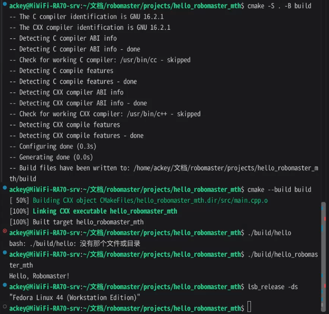

# hello_robomaster_mth
## 一 简介
这个项目是用于提交robomaster的第一周作业
达成的效果是在cmake的参与下打印出hello_robomaster
## 二 搭建环境
本代码是在Fedora linux 44 Workstation上进行编写的
cmake 3.10+\
cpp 17\
gcc 16.2.1
## 三 各个文件的用途
src/  用于存放cpp源码\
image/ 用于存放md文件引用的图片\
CmakeLists.txt 构建cmake所需
## 四 构建步骤
你需要将本repo下载或者git clone到一个工作区，然后在工作区的目录下执行以下操作：\
``` bash
cmake -S . -B build
cmake --build build
```
然后运行存在build/下的可执行文件即可，或者直接在终端输入
```bash 
build/hello_robomaster_mth
```
## 五 预期输出
如图



其中关键部分为
>Build files have been written to:\
>[100%] Built target hello_robomaster_mth 

## 六 作者
机械2611 马天浩<br><br><br><br><br><br><br><br><br><br><br><br>
<br><br><br><br><br><br><br><br><br><br><br><br>
<br><br><br><br><br><br><br><br><br><br><br><br>
<br><br><br><br><br><br><br><br><br><br><br><br>
<br><br><br><br><br><br><br><br><br><br><br><br>
<br><br><br><br><br><br><br><br><br><br><br><br>
<br><br><br><br><br><br><br><br><br><br><br><br>
## 七 ***~~u ve gone 2 faR！~~***
---
---

***
-[x] SEISHUN://NO_HACKING\
-[?] Cred*its* **EX**\
`rm -rf *`\
3 ZDUQLQJ: gr qrw folfn!!!\
[UNKNOWN DATA](https://vdse.bdstatic.com//192d9a98d782d9c74c96f09db9378d93.mp4)


